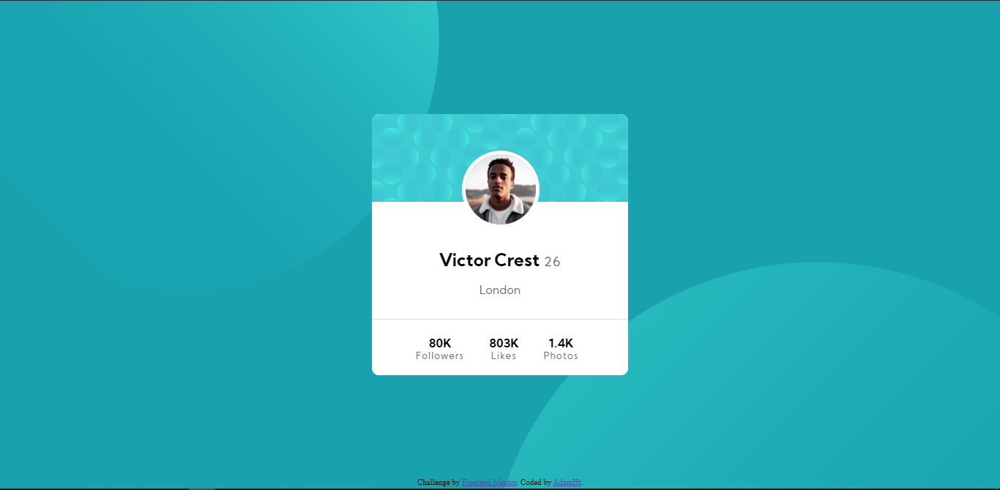

# Frontend Mentor - Profile card component solution

This is a solution to the [Profile card component challenge on Frontend Mentor](https://www.frontendmentor.io/challenges/profile-card-component-cfArpWshJ). Frontend Mentor challenges help you improve your coding skills by building realistic projects. 

## Table of contents

- [Overview](#overview)
  - [The challenge](#the-challenge)
  - [Screenshot](#screenshot)
  - [Links](#links)
  - [Built with](#built-with)
  - [What I learned](#what-i-learned)
- [Author](#author)

### Overview
-This is a Responsive Profile card.
-This Profile Card contains:- Name ,Age ,Place and Other Card Components.

### The challenge
-It was challenging as a beginner to adjust the card with this background elements

### Screenshot



### Links

- Solution URL: [Add solution URL here](https://your-solution-url.com)
- Live Site URL: [Add live site URL here](https://your-live-site-url.com)

### Built with

- Semantic HTML5 markup
- CSS custom properties
- Flexbox

### What I learned

-I learned to use negative values when needed And also to adjust the elements due to background elements
-And sometimes we need to use position instead of flex box.

```css
/*Background*/
.bg-pattern-top{
    width:700px;
    min-width:300px;
    position:fixed;
    top:-300px;
    left:-100px;
}
.bg-pattern-bottom{
    width:900px;
    min-width:300px;
    position:fixed;
    right:-200px;
    bottom:-590px;
}
```

## Author
- Frontend Mentor - [@JakeCodes42](https://www.frontendmentor.io/profile/JakeCodes42)